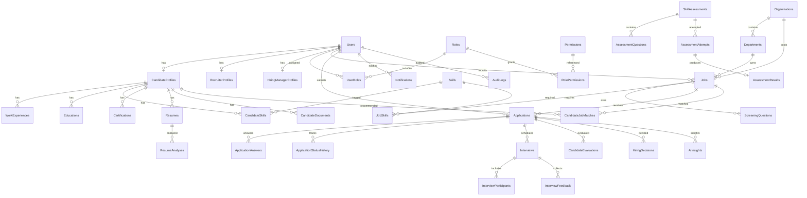

# HireSphere — Entity Relationship Diagram

**Last updated:** 2026-07-20 (Phase 2)
**Scope:** Core implemented entities in `ApplicationDbContext`

## Delete-behavior highlights (Phase 2)

| Relationship | On delete | Rationale |
|--------------|-----------|-----------|
| Job → Applications | **Restrict** | Preserve application history if job retired |
| Application → Interviews | **Restrict** | Preserve interview records |
| Application → StatusHistory | Cascade | History removed only when application hard-deleted |
| User → CandidateProfile | Cascade | Profile is owned by user account |

## Diagram notes

- String `Users.Role` coexists with normalized `Roles` / `UserRoles` during RBAC transition (Phase 3).
- Optional org/department FKs on jobs and staff profiles support multi-tenant expansion.
- AI and assessment subgraphs are modeled but not fully exposed via API until later phases.
