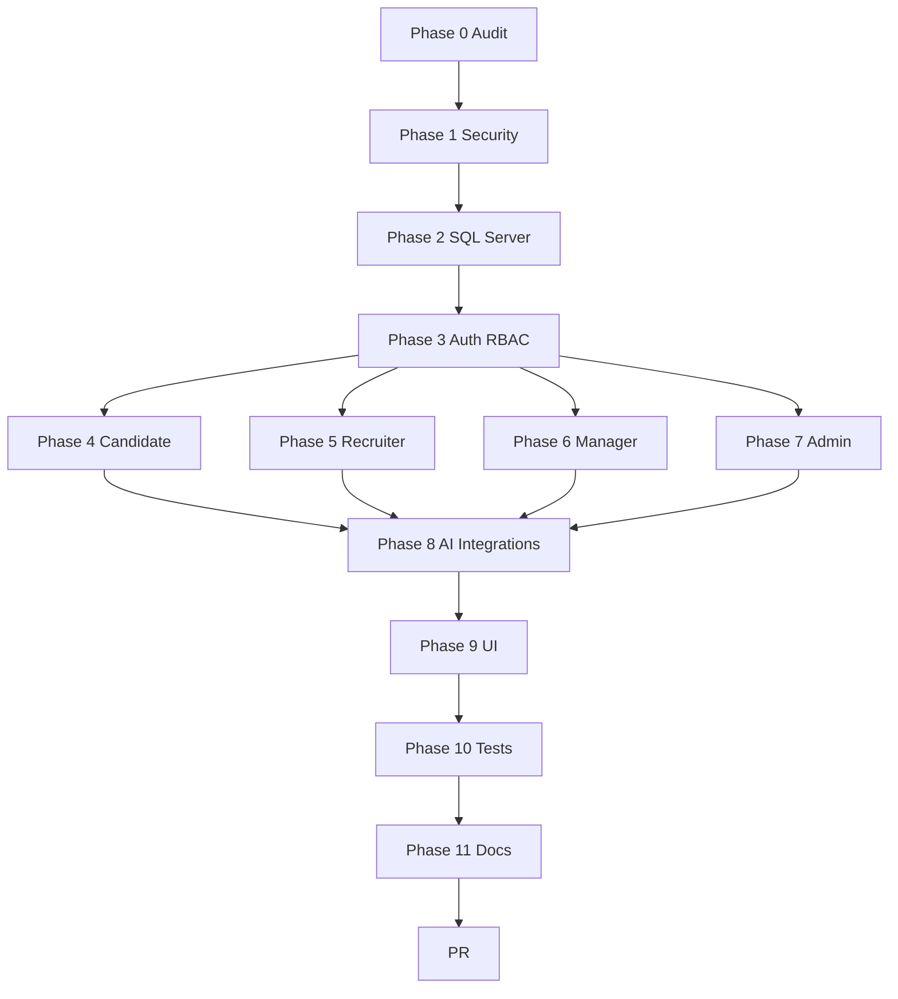

# HireSphere — Implementation Plan

**Target:** COURSEWORK SUBMISSION READY  
**Branch:** `kalanirashmika/coursework-completion`  
**Strategy:** Pragmatic modular monolith — extend existing API/frontend incrementally

---

## Prerequisites (human actions)

1. Install GitHub CLI and authenticate as `kalanirashmika`
2. Configure local git author name and verified email
3. Install Node.js LTS and SQL Server (or Docker SQL Server)
4. Create `local-spec/SE205.3-Coursework-2026.docx` locally (gitignored)
5. Rotate exposed credentials documented in `docs/security/SECRET_ROTATION_REQUIRED.md`

---

## Phase 0 — Audit and planning

**Commit:** `chore(audit): document baseline gaps and coursework plan` (`07080b1`)

- [x] Identity gate assessment
- [x] `CURRENT_PROJECT_AUDIT.md`
- [x] `COURSEWORK_REQUIREMENT_MATRIX.md`
- [x] `IMPLEMENTATION_PLAN.md`, `DEFINITION_OF_DONE.md`, `RISK_REGISTER.md`
- [x] `PHASE_STATUS.md`, `SECRET_ROTATION_REQUIRED.md`
- [x] Commit and push

---

## Phase 1 — Security foundation (current)

**Commit:** `fix(security): secure credentials authentication and API configuration`

1. [x] Remove secrets from tracked `appsettings.json`; use User Secrets + env vars
2. [x] Implement BCrypt password hasher for register/login
3. [x] Restrict CORS to configured frontend origin(s)
4. [x] Disable public registration for Admin/HiringManager/Recruiter
5. [x] Add `appsettings.Development.json` template without real secrets
6. [x] Global exception middleware + sanitized error responses
7. [x] Centralize frontend API base URL; replace Hireflow branding on auth pages

**Exit criteria:** No plaintext passwords; no secrets in git; CORS restricted; build passes.

---

## Phase 2 — SQL Server and data model

**Commit:** `refactor(data): migrate persistence to SQL Server and complete core model`

1. Replace Pomelo MySQL with `Microsoft.EntityFrameworkCore.SqlServer`
2. Add entities: Role, Organization, Department, Resume, Interview (DbSet), SkillAssessment (DbSet), AuditLog, etc.
3. Fresh SQL Server migrations; seed deterministic demo data
4. Data dictionary and ER diagram in `docs/architecture/`
5. Wire orphan models into DbContext

**Exit criteria:** Empty DB migrates and seeds; API starts against SQL Server.

---

## Phase 3 — Auth and RBAC

**Commit:** `feat(auth): implement secure role based access and account workflows`

1. Role/permission tables or normalized role enum with policies
2. Current-user endpoint, password change
3. Recruiter request + admin approval workflow
4. Hiring manager assignment by admin
5. Frontend auth context, protected routes, role-based redirects
6. Fix API URL consistency (`VITE_API_BASE_URL`)

**Exit criteria:** Four roles routable; privilege escalation blocked in tests.

---

## Phase 4 — Candidate workflows

**Commits:**
- [x] `feat(candidate): complete profile resume and document workflows`
- [x] `feat(candidate): add job discovery recommendations and applications`
- [x] `feat(candidate): add assessment interview and tracking experience` (implemented 2026-07-20; commit pending parent)

Profile UI, resume upload (local then cloud in Phase 8), job search/filter, application wizard, timeline, assessment and interview views. Phase 4 not VERIFIED without full E2E.

---

## Phase 5 — Recruiter workflows

**Commits:**
- `feat(recruiter): add job management and applicant pipeline`
- `feat(recruiter): add screening ranking assessments and communication`
- `feat(recruiter): add interview scheduling and recruitment reports`

Full recruiter dashboard, pipeline, shortlisting, messaging/notifications.

---

## Phase 6 — Hiring Manager

**Commit:** `feat(manager): add candidate evaluation feedback and hiring decisions`

Dashboard, shortlisted review, feedback forms, scoring, hiring decision with audit trail.

---

## Phase 7 — Administrator

**Commit:** `feat(admin): add access organization workforce monitoring and analytics`

User/role/org/department CRUD, recruiter approval, workforce overview, audit log viewer, basic analytics.

---

## Phase 8 — AI and integrations

**Commits:**
- `feat(ai): add resume parsing matching ranking and trend insights`
- `feat(integrations): add email SMS and calendar providers`
- `feat(storage): add secure cloud document storage`

Rule-based AI provider first; adapter pattern for external services; honest BLOCKED status for missing credentials.

---

## Phase 9 — UI design system

**Commit:** `feat(ui): complete responsive accessible HireSphere design system`

Replace Hireflow branding; implement design tokens; shared components; responsive layouts for all major pages.

---

## Phase 10 — Quality and evidence

**Commit:** `test(quality): add automated integration UAT and usability evidence`

xUnit API tests, Vitest component tests, Postman collection, UAT scripts, usability plan (pending real sessions).

---

## Phase 11 — Submission pack

**Commit:** `docs(submission): finalize architecture report and submission pack`

Report draft, diagrams, contribution doc, demo script, submission checklist, final verification report.

---

## Phase 12 — Pull request

Create PR to `main` (do not merge). Title: `Complete HireSphere SE205.3 coursework implementation`.

---

## Estimated dependency graph

